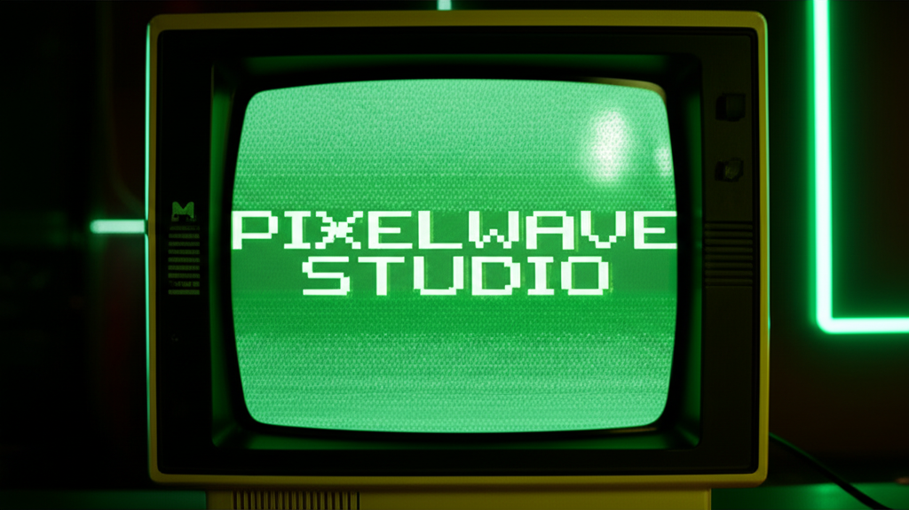

# 🌊 PixelWave Studio

**Transform images into mesmerizing animated patterns using vintage dithering algorithms**

A retro-futuristic web application that brings the nostalgic charm of CRT monitors and vintage computer graphics to modern image processing. Built with Next.js, TypeScript, and Canvas API.

[](https://vercel.com/lakssh-projects/v0-animated-dither-effect)
[](https://v0.app/chat/projects/u8yrAQPuYHo)

## ✨ Features

- 🖼️ **Image Upload & Processing** - Drag & drop or browse to upload images
- 🎨 **Real-time Dithering Effects** - Multiple vintage algorithms (Floyd-Steinberg, Ordered, Random)
- 📺 **CRT Monitor Simulation** - Authentic retro display with scanlines and curvature
- 🎵 **Audio Integration** - Ambient soundscapes and interactive audio feedback
- 📹 **Video Recording** - Export your creations as MP4 videos
- 🎮 **Interactive Controls** - Real-time parameter adjustment
- 📱 **Responsive Design** - Works seamlessly on desktop and mobile
- 🌙 **Dark Theme** - Cyberpunk-inspired UI with neon accents

## 🏗️ Project Structure

\`\`\`
animated-dither-background/
├── app/
│   ├── globals.css              # Global styles and font definitions
│   ├── layout.tsx               # Root layout with metadata and providers
│   └── page.tsx                 # Main page component
├── components/
│   ├── ui/
│   │   └── button.tsx           # Reusable button component
│   ├── animated-dither-background.tsx  # Main application component
│   ├── audio-manager.tsx        # Audio system management
│   ├── canvas-renderer.tsx      # Canvas rendering and effects engine
│   ├── image-loader.tsx         # Image upload and gallery management
│   ├── theme-provider.tsx       # Dark/light theme context
│   ├── theme-toggle.tsx         # Theme switcher component
│   ├── ui-components.tsx        # Custom UI components (sliders, buttons)
│   └── video-recorder.tsx       # Screen recording functionality
├── public/
│   ├── fonts/
│   │   └── Orbitron-VariableFont_wght.ttf  # Custom Orbitron font
│   ├── og-image.png             # OpenGraph social media image
│   └── sample-image.png         # Default sample image
└── lib/
    └── utils.ts                 # Utility functions and helpers
\`\`\`

## 🎨 Implementation Details

### **Canvas Rendering Engine**
The heart of the application lies in `canvas-renderer.tsx`, which implements:
- **Real-time dithering algorithms** using pixel manipulation
- **CRT simulation effects** with scanlines, curvature, and phosphor glow
- **Responsive canvas sizing** that adapts to different screen sizes
- **Performance optimization** with requestAnimationFrame loops

### **Dithering Algorithms**
- **Floyd-Steinberg**: Error diffusion dithering for smooth gradients
- **Ordered Dithering**: Pattern-based dithering using Bayer matrices
- **Random Dithering**: Noise-based approach for artistic effects
- **Threshold**: Simple binary conversion with adjustable levels

### **Audio System**
The `audio-manager.tsx` component provides:
- **Ambient soundscapes** for immersive experience
- **Interactive audio feedback** responding to user actions
- **Web Audio API integration** for real-time audio processing
- **Volume controls** and audio state management

### **Video Recording**
Built-in screen recording via `video-recorder.tsx`:
- **MediaRecorder API** for capturing canvas output
- **MP4 export** with configurable quality settings
- **Real-time preview** during recording
- **Download management** for exported videos

## 🎯 Typography & Design

### **Font Strategy**
- **Orbitron**: Used for branding ("PIXELWAVE STUDIO") and UI elements
- **Monospace**: Used for descriptive text, instructions, and terminal-style content
- **Custom font loading**: Local Orbitron variable font for optimal performance

### **Color Palette**
- **Primary Green**: `#00ff41` - Signature neon green for accents
- **Dark Background**: `#0a0a0a` - Deep black for contrast
- **Gray Tones**: Various shades for UI elements and text
- **Glow Effects**: CSS box-shadow for authentic CRT phosphor simulation

## 🚀 Getting Started

### Prerequisites
- Node.js 18+ 
- npm or yarn

### Installation
\`\`\`bash
# Clone the repository
git clone https://github.com/your-username/animated-dither-background.git

# Navigate to project directory
cd animated-dither-background

# Install dependencies
npm install

# Start development server
npm run dev
\`\`\`

### Usage
1. **Upload an image** by dragging & dropping or clicking "Browse"
2. **Select an effect** from the available dithering algorithms
3. **Adjust parameters** using the real-time controls
4. **Record your creation** using the built-in video recorder
5. **Export as MP4** and share your retro masterpiece

## 🛠️ Technologies Used

- **Next.js 14** - React framework with App Router
- **TypeScript** - Type-safe development
- **Tailwind CSS** - Utility-first styling
- **Canvas API** - Real-time image processing
- **Web Audio API** - Interactive audio features
- **MediaRecorder API** - Video recording capabilities
- **Shadcn/ui** - Component library for consistent UI

## 🎮 Controls & Features

### **Effect Parameters**
- **Intensity**: Controls the strength of the dithering effect
- **Speed**: Animation speed for dynamic effects
- **Scale**: Zoom level for detailed viewing
- **Threshold**: Binary conversion sensitivity

### **Audio Controls**
- **Volume slider**: Adjust ambient audio levels
- **Mute toggle**: Quick audio on/off
- **Sound effects**: Interactive feedback sounds

### **Recording Options**
- **Start/Stop recording**: Capture your animated creations
- **Format selection**: Export as MP4
- **Quality settings**: Optimize file size vs. quality

## 🌟 Future Enhancements

- [ ] Additional dithering algorithms (Atkinson, Burkes)
- [ ] Color palette customization
- [ ] Batch processing for multiple images
- [ ] Social sharing integration
- [ ] Preset effect combinations
- [ ] Advanced CRT simulation (chromatic aberration, bloom)

## 📄 License

This project is open source and available under the [MIT License](LICENSE).

## 🙏 Acknowledgments

- **CRAFTED WITH 💚 USING [v0.app](https://v0.app) BY [@BLAKSSH](https://github.com/blakssh)**
- **NO PIXELS WERE HARMED IN THE MAKING OF THIS APP**

---

*Experience the nostalgia of vintage computing with modern web technologies. Transform your images into pixel art masterpieces with PixelWave Studio.*
\`\`\`

```tsx file="components/ui-components.tsx"
[v0-no-op-code-block-prefix]import React from 'react';
import { Button } from '@chakra-ui/react';

const CustomButton = ({ children, ...props }) => {
  return (
    <Button
      {...props}
      _hover={{
        shadow: '0 0 8px rgba(0,255,65,0.3)',
      }}
      _focus={{
        shadow: '0 0 8px rgba(0,255,65,0.3)',
      }}
    >
      {children}
    </Button>
  );
};

export default CustomButton;
